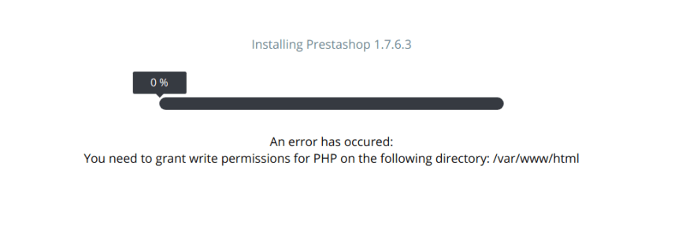
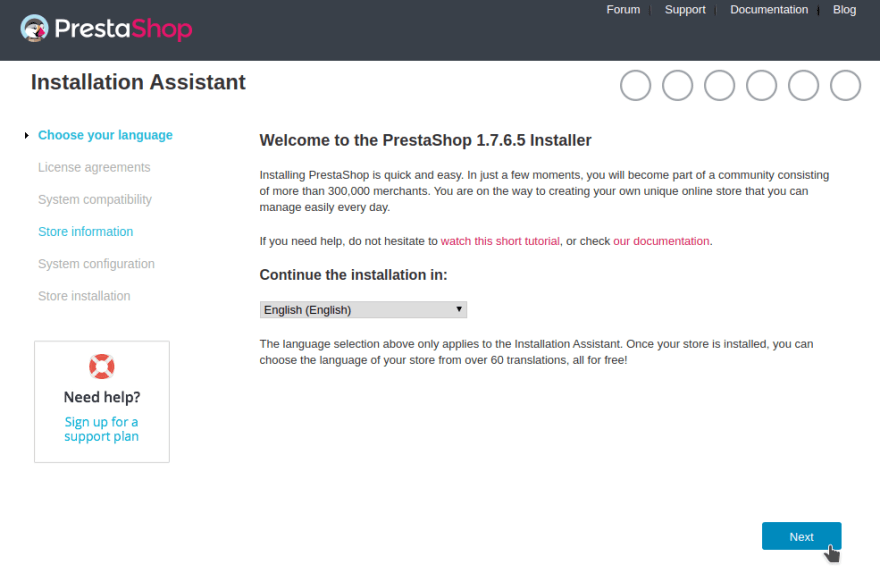
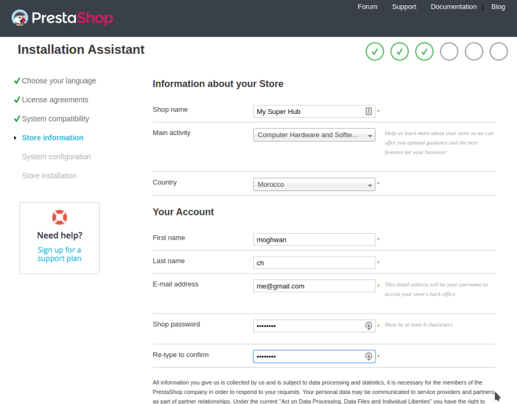
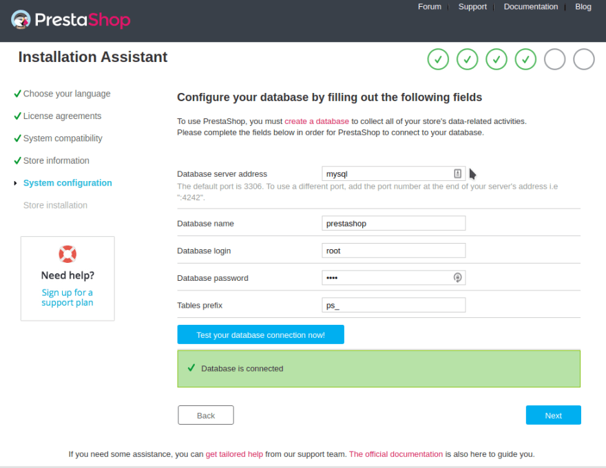
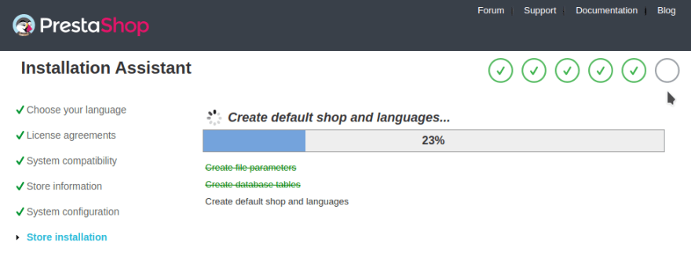
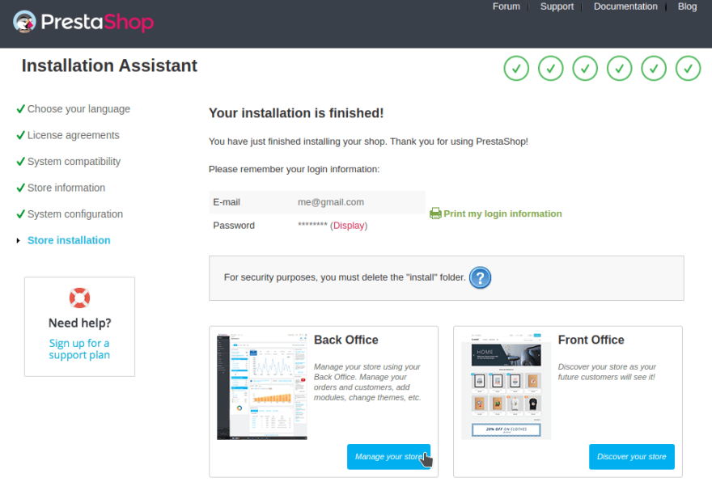
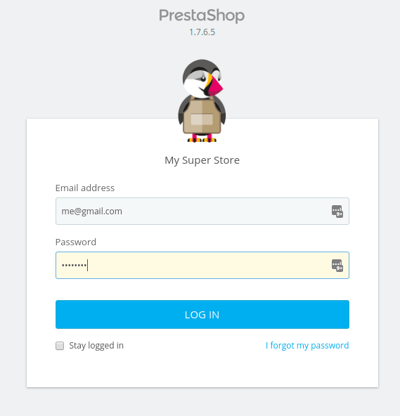
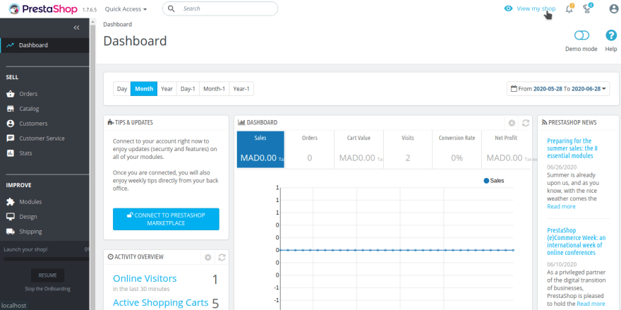

So basically I want to dockerize all my php based projects (Wordpress, Laravel, Symfony...) after switching from OS to another, and Prestashop was among them.

So I'm writing this (my first) post so it will be a kind of reference for me in the future and I'll do the same for the others frameworks/CMSs.

Let’s dive into it!

Before we start, clone this repo:

```
git clone https://github.com/moghwan/docker-prestashop-boilerplate.git
```
The repo structure should look like this:

```
docker-prestashop-boilerplate/
├── config/
│ └── presta.conf
├── .env
├── docker-compose-ps.yml
├── Dockerfile
├── prestashop_1.7.6.5.zip
└── README.md
```

Let me explain and show you files' content:

**config/presta.conf**: a config file for apache enabling virtual host

```
<VirtualHost *:80>
  ServerAdmin webmaster@localhost
  DocumentRoot /var/www/html
  ErrorLog ${APACHE_LOG_DIR}/error.log
  CustomLog ${APACHE_LOG_DIR}/access.log combined
  <Directory /var/www/html>
    AllowOverride All
  </Directory>
</VirtualHost>
```

**.env**: contains COMPOSE_PROJECT_NAME environment variables.

```
COMPOSE_PROJECT_NAME=prestadock
```

It’s preferable to change it to your project name so we can avoid the collision with other running container with the same name, basically it just a prefix for containers’ names.

**docker-compose-ps.yml**: our compose file, we will remove the “-ps” suffixe later.

```
version: '2'
services:

mysql:
image: mysql:5.7
environment:
MYSQL_ROOT_PASSWORD: root
MYSQL_DATABASE: prestashop
volumes:
- ./.docker/data/mysql/:/var/lib/mysql
- ./.docker/logs/mysql/:/var/log/mysql
ports:
- "3306:3306"

phpmyadmin:
image: phpmyadmin/phpmyadmin
ports:
- 8080:80
env_file:
- .env
environment:
PMA_HOST: mysql
VIRTUAL_HOST: phpmyadmin.test

app_dev:
build: .
environment:
- VIRTUAL_HOST=prestashop.test
volumes :
- ./:/var/www/html:rw
restart: always
ports:
- 80:80
links:
- "mysql"
```

**Dockerfile**: our docker image.
```
FROM ubuntu:18.04
# Install.
RUN \
sed -i 's/# \(.*multiverse$\)/\1/g' /etc/apt/sources.list && \
apt-get update && \
apt-get -y upgrade && \
apt-get install -y build-essential && \
apt-get install -y software-properties-common && \
apt-get install -y byobu curl git htop man unzip vim wget && \
rm -rf /var/lib/apt/lists/*
ARG DEBIAN_FRONTEND=noninteractive
RUN apt-get update
RUN apt-get upgrade
RUN apt-get install -y apache2 libapache2-mod-php
RUN apt install -y php unzip
RUN apt-get install -y php-cli php-common php-mbstring php-gd php-intl php-xml php-mysql php-zip php-curl php-xmlrpc
COPY . /var/www/html:rw
COPY ./config/presta.conf /etc/apache2/sites-available/000-default.conf
RUN a2enmod rewrite
# Define working directory.
WORKDIR /var/www/html
# Define default command.
EXPOSE 80
CMD apachectl -D FOREGROUND
```

**Prestashop_1.7.6.5.zip**: the last stable archive downloaded from [here](https://www.prestashop.com/en/download)

**README.md**: a copy of the instructions explained in this post, just in case.

## Let’s get started.

First extract the archive then delete it:

```
cd docker-prestashop-boilerplate

unzip prestashop_1.7.6.5.zip && rm prestashop_1.7.6.5.zip
```

It's preferable to change the project name in the .env file to whatever you want.

Then build the docker-compose-ps.yml and run the containers:
```
docker-compose -f docker-compose-ps.yml up -d --build
```
You’ll notice that another docker-compose.yml file already exists in the same directory, which was extracted from the prestashop zip file. but we will use ours because it includes the phpmyadmin image and some virtual hosts.

After the build is finished the containers should be up.
Now navigate to [localhost](http://localhost/) in your browser and you should see this page:



To fix this run these command inside the container:

```
docker exec -ti prestadock_app_dev_1 bash
chown www-data:www-data -R .
exit
```

Notice that prestadock is the project name for my case.

Refresh browser, the install process should begin.

let's continue the install process step-by-step:


Choose your language and continue.


Agree to the licence and continue.


Fill your store infos and continue.


For database server type **mysql**, and database password type **root** as below:


If the database connection is failed (happened to me in another setup) you can create another mysql user and use it instead of root user as below:

```
docker exec -ti prestadock_mysql_1 bash
chown -R mysql:mysql /var/lib/mysql
mysql -u root -p
# password: root
CREATE USER 'ps_user'@'%' IDENTIFIED BY 'user';
GRANT ALL ON *.* TO 'ps_user'@'%';
FLUSH PRIVILEGES;
EXIT;
exit
```

Our mysql user is identified as **ps_user** with **user** as password.

Now grab your second cup of coffee and chill for a moment.


Now head to your store front office:


tada!


before heading to the back office we should do some cleaning first:
```
docker exec -ti prestadock_app_dev_1 bash

rm -rf install
rm docker-compose.yml
mv docker-compose-ps.yml docker-compose.yml
exit

docker-compose down --remove-orphans
docker-compose up -d
```

Now you can log into the back office without problems.



so much zeros :o



And voilà!

## Conclusion
This Docker Compose Prestashop boilerplate was created to be able to jump from standard X/M/LAMP stack, mainly for my case, avoiding the hassle to install/configure local webserver after every OS switch (special thanks to linux :)).

##Found a Typo?
Just let me know in the comments. Hope you found this article helpful!
